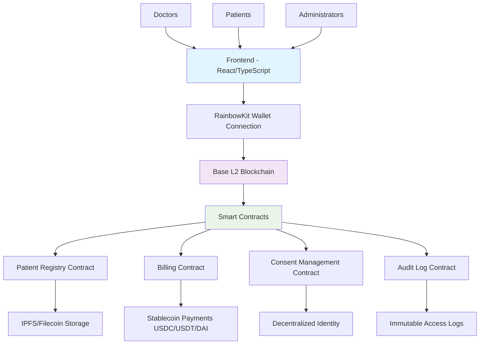
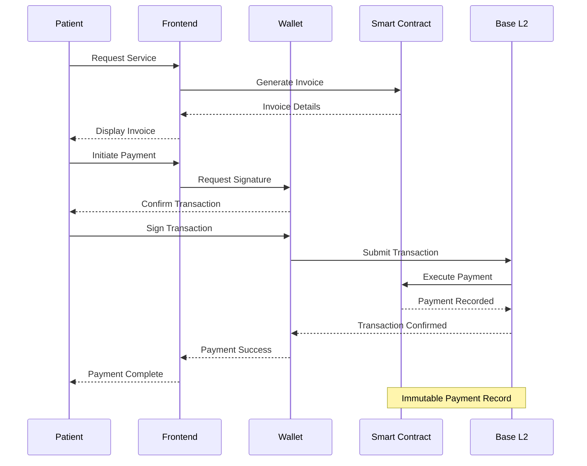
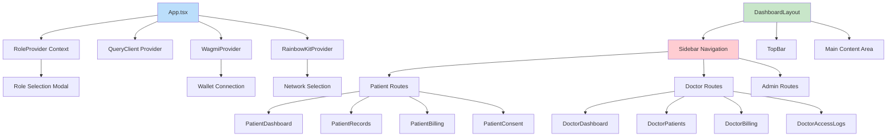
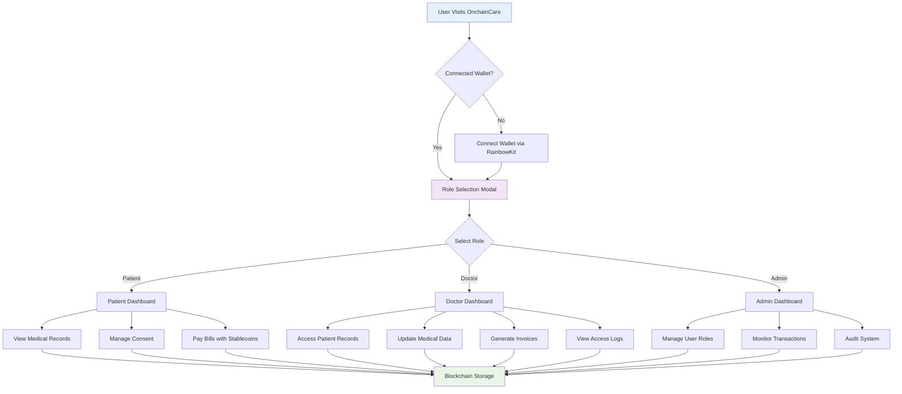
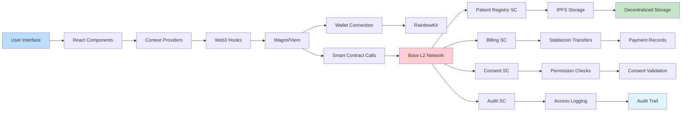

# OnchainCare

## Decentralized Hospital Management System on Blockchain

OnchainCare is a revolutionary decentralized healthcare management platform built on blockchain technology. It provides secure, transparent, and patient-centric healthcare services by leveraging smart contracts, decentralized identity, and cryptocurrency payments. The system enables doctors, patients, and administrators to manage medical records, appointments, billing, and access logs in a trustless environment.

## System Architecture



### Key Features

- **Decentralized Patient Records**: Immutable medical records stored on blockchain ensuring data integrity and patient ownership
- **Smart Contract-Based Billing**: Transparent billing system with cryptocurrency payments
- **Role-Based Access Control**: Secure access management for doctors, patients, and administrators
- **Consent Management**: Patient-controlled data sharing with granular consent permissions
- **Doctor Access Logs**: Transparent logging of all medical record accesses
- **Wallet Integration**: Seamless connection with crypto wallets for authentication and payments

## Blockchain Integration

### Rainbow Kit Integration

OnchainCare uses [Rainbow Kit](https://www.rainbowkit.com/) for seamless wallet connection, supporting multiple blockchain networks and wallet providers:

- **Multi-Network Support**: Connect to Ethereum, Polygon, Arbitrum, and other EVM-compatible chains
- **Wallet Providers**: Support for MetaMask, WalletConnect, Coinbase Wallet, and more
- **Smart Account Integration**: Ready for ERC-4337 account abstraction
- **Gasless Transactions**: Optimized for user experience with gas estimation

### Smart Contracts

The platform integrates with custom smart contracts for:
- Patient data management and consent
- Medical billing and payment processing
- Access control and audit logging
- Decentralized identity verification

### Stable Coin Payments

OnchainCare supports seamless payments using stablecoins for all healthcare services:

#### Supported Stablecoins
- **USDC (USD Coin)**: Primary stablecoin for medical billing and payments
- **USDT (Tether)**: Alternative stablecoin option
- **DAI**: Decentralized stablecoin support

#### Payment Features
- **Instant Settlements**: Real-time payment processing on Base L2
- **Low Fees**: Sub-cent transaction costs for all payments
- **Transparent Pricing**: Smart contract-based pricing with no hidden fees
- **Multi-Currency**: Support for ETH and stablecoin payments
- **Refund Protection**: Built-in dispute resolution for payment issues

#### Billing Integration
- **Automated Invoicing**: Smart contracts generate and send invoices
- **Payment Tracking**: Immutable payment history on blockchain
- **Insurance Integration**: Compatible with decentralized insurance protocols
- **Cross-Border Payments**: Global payments without currency conversion fees

## Payment Flow



### Web3 Stack

- **Wagmi**: React hooks for Ethereum
- **Viem**: TypeScript interface for Ethereum
- **RainbowKit**: Wallet connection UI
- **Ethers.js/Viem**: Blockchain interaction

## Technologies Used

### Frontend
- **React 19**: Latest React with concurrent features
- **TypeScript**: Type-safe development
- **Vite**: Fast build tool and dev server
- **shadcn/ui**: Modern UI components
- **Tailwind CSS**: Utility-first CSS framework

### Blockchain & Web3
- **Wagmi**: Ethereum React hooks
- **Viem**: Ethereum TypeScript library
- **RainbowKit**: Wallet connection
- **Smart Contracts**: Solidity-based contracts

### Development Tools
- **React Router DOM**: Client-side routing
- **React Hook Form**: Form management
- **Zod**: Schema validation
- **Recharts**: Data visualization
- **Framer Motion**: Animations

## Getting Started

### Prerequisites

- Node.js (v18 or higher)
- pnpm, npm, or yarn
- A Web3 wallet (MetaMask, etc.)

### Installation

1. Clone the repository:
   ```bash
   git clone <repository-url>
   cd OnchainCare
   ```

2. Install dependencies:
   ```bash
   pnpm install
   # or
   npm install
   ```

3. Start the development server:
   ```bash
   pnpm dev
   # or
   npm run dev
   ```

4. Open [http://localhost:8080](http://localhost:8080) in your browser.

### Build for Production

```bash
pnpm build
# or
npm run build
```

### Preview Production Build

```bash
pnpm preview
# or
npm run preview
```

## Project Structure

```
src/
├── components/
│   ├── doctor/          # Doctor dashboard components
│   ├── patient/         # Patient dashboard components
│   ├── layout/          # Layout and navigation
│   ├── modals/          # Modal dialogs
│   └── ui/              # Reusable UI components
├── contexts/            # React contexts (Role, etc.)
├── hooks/               # Custom React hooks
├── lib/
│   ├── utils.ts         # Utility functions
│   ├── mock-data.ts     # Mock data for development
│   └── web3/            # Web3 configurations and contracts
├── pages/               # Route-based page components
└── App.tsx              # Main application component
```

## Component Architecture



## Usage

### For Patients
1. Connect your wallet using Rainbow Kit
2. View and manage your medical records
3. Grant/revoke consent for data sharing
4. Pay bills using cryptocurrency
5. Track doctor access to your records

### For Doctors
1. Connect professional wallet
2. Access authorized patient records
3. Update medical information
4. Generate bills and invoices
5. View access logs for compliance

### For Administrators
1. Manage user roles and permissions
2. Oversee system operations
3. Monitor blockchain transactions
4. Handle dispute resolution

## User Role Flow



## Security & Privacy

- **Zero-Knowledge Proofs**: Privacy-preserving computations
- **End-to-End Encryption**: Data encrypted before blockchain storage
- **Decentralized Identity**: Self-sovereign identity management
- **Audit Trails**: Immutable access logs for compliance
- **Smart Contract Audits**: Regular security audits of contracts

## Data Flow Architecture



## Contributing

We welcome contributions to OnchainCare!

1. Fork the repository
2. Create a feature branch (`git checkout -b feature/amazing-feature`)
3. Make your changes
4. Run linting: `pnpm lint`
5. Commit your changes (`git commit -m 'Add amazing feature'`)
6. Push to the branch (`git push origin feature/amazing-feature`)
7. Open a Pull Request

## Testing

```bash
# Run tests
pnpm test

# Run linting
pnpm lint
```

## Deployment

The application can be deployed to:
- Vercel
- Netlify
- Traditional web servers
- IPFS for decentralized hosting

## License

This project is licensed under the MIT License - see the [LICENSE](LICENSE) file for details.

## Disclaimer

This is a proof-of-concept implementation. Not intended for production medical use without proper regulatory compliance and security audits.
